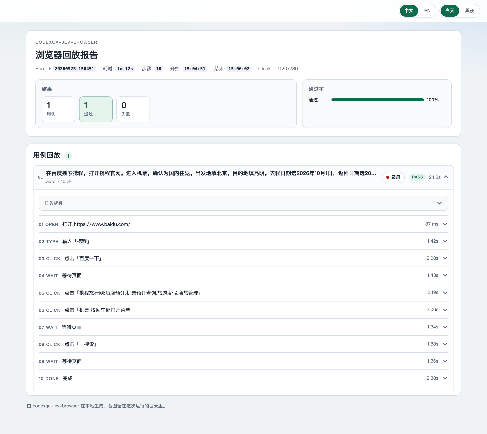

# CodexQA Jev Browser

[简体中文](README.zh-CN.md) · [How it works](HOW_IT_WORKS.md) · [Known limitations](KNOWN_LIMITATIONS.md)

**Jev Browser** is the standalone project at [openqa-cn/jev-browser](https://github.com/openqa-cn/jev-browser). The same skill is also in the [CodexQA](https://github.com/openqa-cn/codexqa) catalog.

<p align="center"><a href="https://htmlpreview.github.io/?https://github.com/openqa-cn/codexqa/blob/main/docs/assets/previews/jev-report.html"></a></p>

GUI-model browser automation sends a screenshot to a vision model on every step. Recognition spends vision tokens, the loop waits for the model to read the image, and the click lands on coordinates.

CodexQA Jev Browser finds controls from an index built inside the page and treats visible page evidence as the result. Replay, goal runs, case generation, and site exploration share that index. The browser is Playwright Chromium. This repository has no benchmark against vision GUI models. The rows below are the structural answers to those costs.

On TypeSafe’s published System One comparison, a Jev decision is **40×–200× faster** than a frontier LLM on the same kind of question (70–500 ms, against multi-second LLM calls). Their workflow demo is **193.6× faster** and **444.6× cheaper**: $0.000081 in 0.114 s versus $0.013880 in 8.566 s. TypeSafe calls that pair the high end of real-world gains. Jev lists input at **$0.042 per million tokens**, **238× lower than Claude Fable 5.1**, and does not bill output tokens. These figures are for the decision call, not for loading the page or saving the report. Source: [TypeSafe](https://typesafe.ai/) and the [launch post](https://typesafe.ai/blog/introducing-system-one-models-and-jev).

## What raises the pass rate

The knowledge base is the main lever. Jev only chooses an indexed control, and the characters it can type are phrases already in the goal. It does not know that a Baidu cite is an ad, that the left city box is the departure city, or that a login dialog means stop. Those facts belong in `knowledge/<app>/*.md`.

A failed live run is usually a missing or wrong note, not a missing selector. Read the report, name the control the model should have used or avoided, and add that sentence to the matching note. `hosts` matches the site. `keywords` match the goal. `general: true` is attached on every run, such as the login-dialog stop. Notes are reference. The model still has to pick an index that was observed. Do not put that site's fill rules into `src/policy.ts`.

## Where traditional automation gets stuck

| Pain | What this runtime does |
| --- | --- |
| A GUI model finds controls from a screenshot, and every step spends vision tokens | The decision receives an index the page already built: role, name, current value, and allowed operations. The model answers a choice question. Screenshots stay in the report and mark the control that was used. |
| Every step waits for a vision model to finish reading the image | Observation runs inside the page. `run`, `explore`, and `--decisions` do not call a decision model. After `generate` writes YAML, `--verify` replays it on the same index. |
| Coordinate and vision grounding miss the control, and a layout change breaks the click | Actions hit `data-codexqa-jev-browser-id`. Cases resolve `role` / `name` / `nth` / `within` against the live index, including controls inside iframes. The index must still be in the action space before the click, and the page is checked again after it. |
| The browser you launch is part of the run | The runtime uses Playwright Chromium. |

## Highlights

- **Closed action space.** Observation assigns each visible control an index, a role, a name, and the operations it actually supports. The decision is accepted only when both the operation and the index are in that set. Selector-like text, JavaScript, and shell in the model reply are rejected before anything runs.
- **Jev answers structured choices.** With `TYPESAFE_API_KEY`, each step is a `/systemone` questionnaire: which operation, and which observed target. The same channel judges whether that one action showed up on the next page. An OpenAI-compatible `chat/completions` call is the fallback decision model. `--decisions` skips both.
- **The browser is Playwright Chromium.** Password field values are left out of model requests.
- **Generated cases replay without the decision model.** YAML, Markdown, and API cases name targets as `{role, name, nth, within}`. Those fields are resolved against the live index, including controls inside iframes. `generate` writes that YAML after every successful step. `--verify` then replays the file through `run`.
- **Visible evidence decides the result.** A planner names `done_when` as something that must be on the page. `DONE` passes only when that evidence is visible. A failed assertion still runs teardown. The HTML report keeps the marked screenshot, step timing, token use, and the session video.

## Architecture

`observe`, `run`, `explore`, and `--decisions` stop at the index and the actor. Live `auto` and `generate --goal` add the planner and a decision provider. `generate` turns a passing trace back into a case the actor can replay alone.

Typing uses characters the same Jev decision chooses from phrases already in the goal. Which control receives them is still the node id on the index. Notes in `knowledge/<app>/` stay on that decision.

## Install

```bash
npm install
cp .env.example .env   # live auto / generate --goal
```

Model calls use `HTTPS_PROXY` only when that variable is set.

Node.js 20 or newer.

## Model

The CLI calls Jev or an OpenAI-compatible API itself. The host Cursor or Codex session is not the decision model.

| Call | When | Key |
| --- | --- | --- |
| Jev `/systemone` | Per-step operation and target, the per-step effect verdict, and whether the task is done | `TYPESAFE_API_KEY`. Optional: `TYPESAFE_MODEL` (`jev-latest`), `TYPESAFE_BASE_URL` |
| Chat completions | Task plan. Also the whole decision and the done check when Jev is unset | `OPENAI_API_KEY`. Optional: `OPENAI_BASE_URL`, `OPENAI_MODEL`, `TEXT_MODEL` |
| None | `observe`, `run`, `explore`, `auto --decisions`, `generate --decisions` | — |

Priority for the decision provider: `--decisions` script, then Jev when `TYPESAFE_API_KEY` is set, then chat completions. `--model` and `--base-url` override the chat model and gateway. `codexqa-jev-browser.config.yaml` may use `${OPENAI_API_KEY}`-style placeholders. The CLI loads `cwd/.env`, then the repo-root `.env`, and does not overwrite variables already set in the shell. Do not pass `--api-key` or put a raw key in a case file.

Live `auto` / `generate --goal` still needs `OPENAI_API_KEY` for the planner, even when Jev chooses each click.

## Commands

```bash
npx codexqa-jev-browser observe examples/app/index.html
npx codexqa-jev-browser run cases/examples/search-docs.yaml cases/examples/login.yaml
npx codexqa-jev-browser run cases/examples/search-docs.md
npx codexqa-jev-browser run --from-api https://qa.example.com/cases
npx codexqa-jev-browser auto --url examples/app/index.html --goal '搜索 Pilot 并打开文档' \
  --decisions cases/scripts/decisions-search.yaml
npx codexqa-jev-browser generate --url examples/app/index.html --goal '搜索 Pilot 并打开文档' \
  --decisions cases/scripts/decisions-search.yaml --out generated/search.yaml --md --verify
npx codexqa-jev-browser explore --url examples/app/index.html --out generated/explore
```

The window is visible by default. `browser.headless: true` hides it. `--headed` forces a window. `--no-screenshots` skips images.

Reports land in `reports/<run-id>/report.html`. `report.json` is the machine-readable copy. `report.md` is the short summary. A failing case exits non-zero.

## Layout

```text
SKILL.md            Agent entry: when to use this skill and which command to run
bin/                CLI launcher
src/                Runtime. observe/ builds the control index. report/ writes the HTML report
knowledge/          Notes for the decision. general/ applies to every site; other folders are per app
cases/              Replay examples, plus scripted decisions under cases/scripts
examples/app/       Small local HTML pages used by tests and the commands above
references/         Step schema and examples
tests/              Offline checks. They do not call a live site or a live model
agents/openai.yaml  Display name and short description for the Agents surface
docs/jev-report.png Report screenshot shown at the top of this README
reports/            One folder per run. Git ignores it
```

## Portable skill

This directory is the skill. `SKILL.md` sits next to the CLI.

```bash
npx skills add openqa-cn/jev-browser
# or, from the CodexQA catalog:
npx skills add openqa-cn/codexqa --skill codexqa-jev-browser
```

Any agent that can run a shell uses the same CLI. The skill does not call a vendor browser tool.

Schema and verbs: [references/schema.md](references/schema.md). Examples: [references/examples.md](references/examples.md).

## Tests

```bash
npm test
```

Tests are offline. A passing run matches the fixtures. It does not show that a live site or a live model will succeed.
